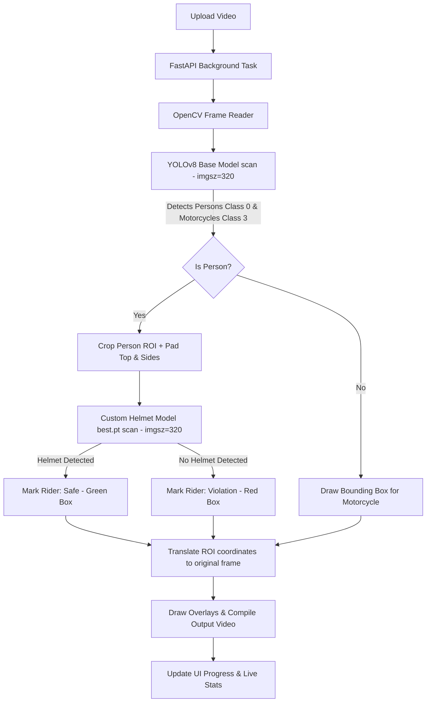

# 🚦 TrafficSentry AI: Real-Time Smart Traffic & Safety Monitoring System

TrafficSentry AI is a state-of-the-art Computer Vision and Deep Learning web application designed to monitor road safety compliance. By leveraging a dual-stage **YOLOv8** pipeline, the system automatically detects motorcyclists and analyzes helmet compliance in real-time, outputting annotated video streams alongside detailed safety metrics and compliance diagnostic reports.

---

## 🚀 Key Features

*   **Glassmorphism UI/UX**: A modern web dashboard built with vanilla HTML, JavaScript, and custom styling featuring fluid micro-animations, progress meters, and dynamic state-switching.
*   **Dual-Stage Deep Learning Pipeline**:
    1.  **Vehicle & Rider Scan**: Runs a fast, light-resolution base model (`yolov8n.pt`) to locate persons and motorcycles.
    2.  **Helmet Check**: Crops the rider's Region of Interest (ROI), applies custom padding, and scans specifically for helmets or bare heads using a custom-trained detector (`best.pt`).
*   **Real-Time Processing Metrics**: Track peak concurrent counts of persons, helmets, and safety violations dynamically as the video processes.
*   **Interactive Video Playback & Download**: Watch the fully rendered, annotated video directly in your browser or download it for archive/auditing.
*   **Detailed Compliance Verdicts**: Generates safety ratings and diagnostic cards based on compliance percentages (e.g., *Excellent Compliance* vs *Safety Warning*).

---

## 🛠️ Technology Stack

*   **Backend**: [FastAPI](https://fastapi.tiangolo.com/) (Asynchronous python web framework)
*   **Deep Learning**: [Ultralytics YOLOv8](https://github.com/ultralytics/ultralytics) (PyTorch-based computer vision framework)
*   **Video Processing**: [OpenCV (opencv-python)](https://opencv.org/)
*   **Frontend**: HTML5, Vanilla CSS3 (custom glassmorphism design system), and Vanilla JavaScript
*   **Model Formats**: PyTorch weights (`.pt`)

---

## 📂 Project Structure

```text
Real-Time Smart Traffic & Safety Monitoring System/
├── app/
│   ├── static/
│   │   ├── css/
│   │   │   └── style.css          # Dark-theme/glassmorphism design styling
│   │   └── js/
│   │       └── app.js             # Frontend API polling, state router, UI interactions
│   ├── templates/
│   │   └── index.html             # Application entrypoint dashboard
│   ├── __init__.py
│   ├── detector.py                # Double-pass computer vision detection core
│   └── main.py                    # FastAPI server routes and background worker
├── models/
│   ├── best.pt                    # Custom trained YOLOv8 model for helmet detection
│   └── yolov8n.pt                 # Pre-trained YOLOv8 nano model
├── temp/                          # Generated during execution (created automatically)
│   ├── uploads/                   # Uploaded raw videos
│   └── processed/                 # Output annotated MP4 files
├── requirements.txt               # Dependencies list
└── README.md                      # Documentation
```

---

## ⚙️ How It Works (The Detection Pipeline)

The core computer vision logic is implemented in [`app/detector.py`](file:///c:/Users/45kin/OneDrive/Desktop/project/Computer%20vision/Real-Time%20Smart%20Traffic%20&%20Safety%20Monitoring%20System/app/detector.py).



### Optimization Details:
1.  **Image Scaling (`imgsz=320`)**: To maximize frames-per-second (FPS) during inference, both models run at an optimized resolution of 320x320 pixels.
2.  **Targeted Scanning (ROI Crop)**: Instead of passing full-sized frames to both models, the custom helmet model only scans small cropped sections around detected riders. This heavily reduces unnecessary compute cycles and prevents background noise from generating false helmet detections.
3.  **Frame Rate Decoupling**: The FastAPI background worker processes frame computations asynchronously. The UI polls progress via the `/status/{task_id}` endpoint every few milliseconds to update the browser without blocking thread execution.

---

## 💻 Installation & Setup

### 1. Prerequisites
Make sure you have **Python 3.8+** installed on your system.

### 2. Clone/Open the Workspace
Open your command terminal (Command Prompt or PowerShell for Windows) in the root directory:
```powershell
cd "c:\Users\45kin\OneDrive\Desktop\project\Computer vision\Real-Time Smart Traffic & Safety Monitoring System"
```

### 3. Install Dependencies
Install all the required python packages using pip:
```powershell
pip install -r requirements.txt
```

### 4. Setup Models
Verify that the YOLO models are placed correctly in the `models` folder:
- **`models/yolov8n.pt`** (Pre-trained detector)
- **`models/best.pt`** (Trained helmet detector)

### 5. Start the Application
Run the FastAPI development server using **Uvicorn**:
```powershell
uvicorn app.main:app --reload
```

After launching, open your browser and navigate to:
**`http://127.0.0.1:8000`**

---

## 📈 Dashboard Walkthrough

1.  **Dropzone Panel**: Drag & drop your video file (supports `.mp4`, `.avi`, `.mov`, `.mkv`) or click **Browse Files** to upload.
2.  **Live Analytics Panel**: Once the upload starts, you will see a circular loading animation showing the percentage progress. The peak counters for *Persons*, *Helmets*, and *Violations* update in real-time.
3.  **Diagnostic Report Panel**: Once processing reaches `100%`, a result panel opens displaying:
    *   An embedded **video player** featuring the fully annotated video track.
    *   **Download button** to save the processed video file locally.
    *   **Compliance Gauge**: Calculates `(Helmets / Total Riders) * 100` to show safety score rating.
    *   **Compliance Verdict Box**: Gives color-coded feedback based on compliance. Green for high safety metrics, Red/Amber for dangerous violations.
